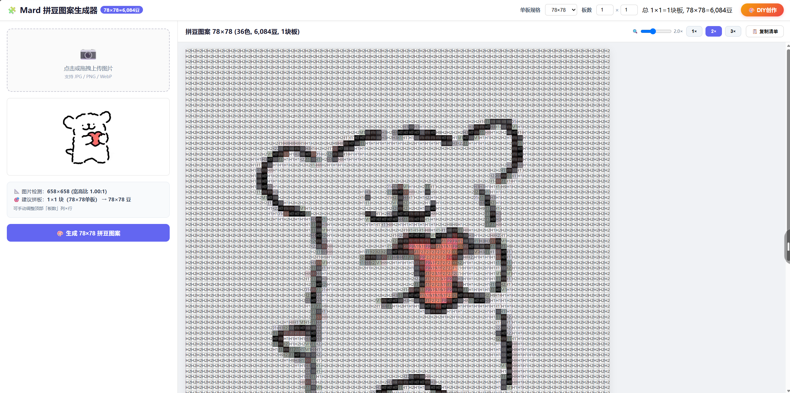
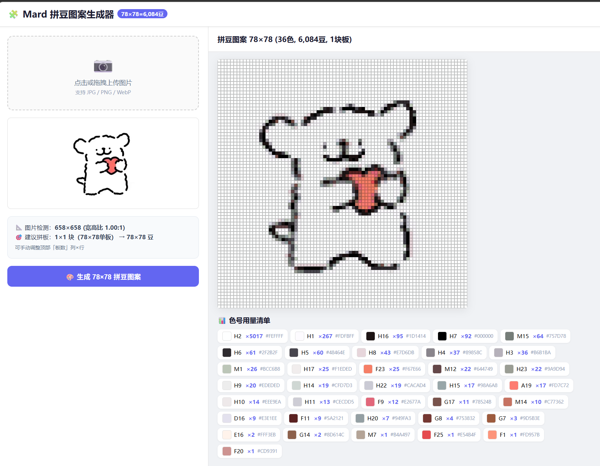
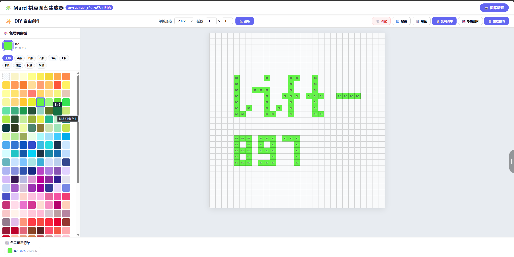

# 🧩 Mard 拼豆图案生成器

一个纯网页端的拼豆（Perler Bead / 豆豆珠）工具，支持 **图片转拼豆色号** + **DIY自由创作** 两大功能。

> 🎨 内置 221 色 Mard 官方色库，覆盖 8 大色系（黄橙/绿/蓝/紫/粉/红/棕/灰+莫兰迪）

---

## 🚀 如何使用

### 方式一：在线使用（推荐）

> 在线地址：`https://lift-897.github.io/mard_bead_converter/`

> **如何开启 GitHub Pages（仓库拥有者操作）：**
> 1. 打开仓库 → 顶部 **Settings** 标签
> 2. 左侧菜单点击 **Pages**
> 3. **Branch** 下拉选 `main`，目录选 `/ (root)`，点击 **Save**
> 4. 等待 1-2 分钟，GitHub 会显示 `Your site is live at ...`
> 5. 之后任何人访问上述地址即可使用

### 方式二：下载使用

1. 点击仓库右上角绿色 **Code** 按钮 → **Download ZIP**
2. 解压后双击打开 `mard_bead_converter.html`
3. 无需安装任何软件，浏览器就能用

---

## 📷 功能一：图片转拼豆（图案转换模式）

将任意图片自动转换为拼豆色号图案，适合按图制作拼豆作品。

| 步骤 | 操作 |
|------|------|
| 1 | 上传 JPG/PNG/WebP 图片 |
| 2 | 选择单板规格（14×14 / 29×29 / 50×50 / 78×78） |
| 3 | 调整板数（列×行），系统会自动建议最佳布局 |
| 4 | 点击「🎨 生成拼豆图案」 |
| 5 | 查看每个格子的色号、缩放图案、复制色号用量清单 |

**功能亮点：**
- 📐 自动宽高比检测，智能推荐拼板布局
- 🔍 支持 0.2× ~ 5× 无极缩放 + 鼠标滚轮缩放
- 📊 自动统计每种色号的用量
- 📋 一键复制色号清单到剪贴板
- 🖱️ 悬停格子可查看色号名称和 HEX 色值

---

## ✨ 功能二：DIY 自由创作

进入全空白画板，自由选择色号拼出你想要的图案！

| 步骤 | 操作 |
|------|------|
| 1 | 点击顶部 **「🎨 DIY创作」** 按钮进入 DIY 模式 |
| 2 | 设置单板规格和板数（列×行） |
| 3 | 点击 **「📐 建板」** 创建空白画板 |
| 4 | 在左侧调色板选择色系标签，点击色块选中颜色 |
| 5 | 在画板上**左键点击**放置拼豆 |
| 6 | **右键点击**擦除（或选橡皮擦 ✕） |

**DIY 工具栏：**
| 按钮 | 功能 |
|------|------|
| 🗑️ 清空 | 清除画板上所有拼豆 |
| ↩️ 撤销 | 撤销上一步操作（最多500步） |
| 📊 用量 | 显示/隐藏色号用量清单 |
| 📋 复制清单 | 复制当前用量清单到剪贴板 |
| 💾 导出图片 | 将当前画板导出为 PNG 图片 |
| 📄 生成报表 | 生成完整 HTML 设计报表（含概览、设计图、板布局、用料清单、采购清单） |

**画画技巧：**
- 按住鼠标左键拖拽可以连续填色
- 按住鼠标右键拖拽可以连续擦除（或选橡皮擦 ✕）
- 点击色系标签（全部/A系/B系/C系/D系/E系/F系/G系/H系/M系）快速筛选
- 当前选中的颜色会高亮显示在调色板顶部
- **💾 自动保存**：设计进度自动保存到浏览器本地存储，关闭页面或切换模式不丢失
- **📄 生成报表**：可生成包含设计概览、像素级设计图、板布局示意图、用料清单、采购清单的完整 HTML 报表，支持打印

---

## 📸 截图展示

### 🏠 主界面

### 图片转拼豆 —— 图案转换模式

### DIY 自由创作模式

### DIY 创作效果示例

---

## 🎨 色库说明

内置 Mard 拼豆 221 种官方色号，按色系分类：

| 色系 | 字母 | 颜色范围 | 数量 |
|------|------|----------|------|
| 黄橙系 | A | 奶油黄 → 橙红 | 26 色 |
| 绿色系 | B | 荧光绿 → 深绿 | 32 色 |
| 蓝色系 | C | 天蓝 → 藏青 | 29 色 |
| 紫色系 | D | 淡紫 → 深紫 | 26 色 |
| 粉色系 | E | 肉粉 → 玫红 | 24 色 |
| 红色系 | F | 粉红 → 暗红 | 25 色 |
| 棕色系 | G | 米白 → 深棕 | 21 色 |
| 灰色系 | H | 纯白 → 纯黑 | 23 色 |
| 莫兰迪系 | M | 莫兰迪高级灰 | 15 色 |

---

## 🛠️ 技术说明

- 纯前端实现，HTML + CSS + JavaScript，无任何依赖
- 图片处理使用 Canvas API 像素采样 + 最近邻色号匹配
- 所有数据在浏览器本地处理，不会上传到任何服务器
- 支持现代浏览器（Chrome / Edge / Firefox / Safari）

---

## 📄 License

MIT

---

## 🔗 相关链接

- Mard 官方色号参考：[mardbeads.com](https://www.mardbeads.com)
- 问题反馈：请在 [Issues](../../issues) 中提出